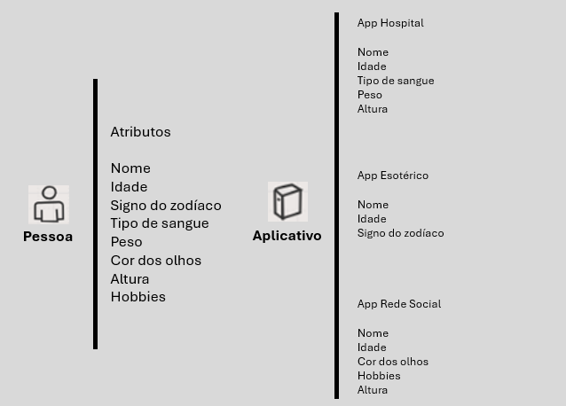

# Exercício 1
**Alex, Maria e Jonas são objetos do tipo Pessoa que possuem uma infinidade de atributos. Alex precisa fornecer dados para se cadastrar em uma clínica médica, enquanto Maria acredita em esoterismo e está se cadastrando em uma agência esotérica para marcar uma consulta com o vidente. Jonas , por sua vez, está se cadastrando em uma rede social, como vocês podem ver são 3 contextos diferentes. Você será solicitado a modelar os objetos (Alex, Maria e Jonas) em três classes de acordo com o contexto explicado no enunciado, o resultado serão 3 classes e a diferença serão os atributos que você os define através da abstração.**

**Você pode adicionar um único método que exiba as informações de cada um desses objetos na tela (alex, maria, jonas)**

**Tomemos como exemplo a seguinte imagem explicada em aula, você pode adicionar atributos se achar necessário**

**Você deve levar em consideração as seguintes atividades:**

**Classe Pessoa modelada a partir do aplicativo de cadastro de uma clínica médica**

**Classe Pessoa modelada a partir do aplicativo de registro de um centro esotérico**

**Classe Pessoa modelada a partir do aplicativo de cadastro de uma rede social**

**Criar instâncias dos 3 objetos do tipo Pessoa (Alex, Maria e Jonas)**

**Mostrar as informações dos objetos através do método mostrar informação**